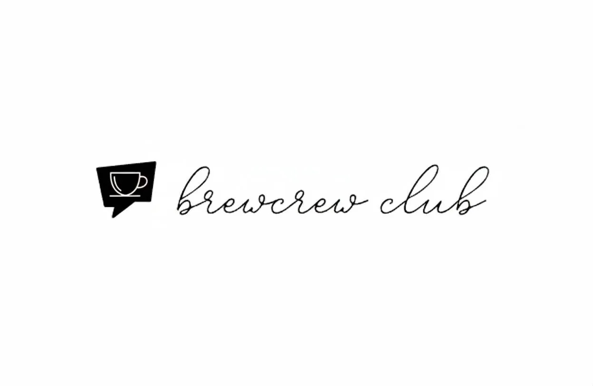

# BrewCrew Club ☕️



[BrewCrew Club](https://brew-crew-club.vercel.app/) is a premium community-driven platform built for India's coffee enthusiasts. Turn coffee from just a drink into an art, hobby, and shared culture by building a vibrant, review-driven café network in India.

## 🎯 What we're solving:

- Coffee in India is often limited to sachets or generic café chains
- Discovering good cafés and quality brews is fragmented and unreliable
- Lack of a unified platform for coffee enthusiasts to connect and share experiences

## 🚀 What we're building:

- **Social Platform**: A comprehensive platform for café explorers and coffee lovers
- **Community Features**: Users can review cafés, share experiences & opinions, and connect with fellow coffee enthusiasts
- **Quality Assurance**: Helps people avoid bad brews while creating a nationwide coffee community
- **Premium UI/UX**: Modern, responsive design with intuitive user experience

## ✨ Features

### Core Features
- **Café Discovery**: Find hidden gem cafés near you with detailed reviews and ratings
- **Community Forum**: Socialize and explore the world of coffee with other coffee lovers
- **Brewing Guide**: Comprehensive coffee brewing methods and techniques
- **Community Features**: Connect with fellow coffee enthusiasts and share experiences
- **Reviews & Ratings**: Honest café reviews and coffee recommendations

### Premium Features
- **Follow & Share**: Subscribe to coffee news and café reviews you like
- **Exclusive Offers**: BrewCrew offers and coupons for your next café journey
- **Partner Dashboard**: Data-driven insights for café partners to attract coffee enthusiasts
- **Mobile Responsive**: Optimized experience across all devices

## 🛠 Tech Stack

**Frontend:**
- React 18 with modern hooks
- Vite for fast development and building
- CSS3 with custom properties and modern layout
- React Router for navigation
- Responsive design with mobile-first approach

**Backend:**
- Node.js with Express
- MongoDB for data persistence
- RESTful API architecture

**Development:**
- ESLint for code quality
- Git for version control
- Modern JavaScript (ES6+)

## 🎨 Design System

- **Color Palette**: Minimal black, white, and yellow accent theme
- **Typography**: Inter font family for premium readability
- **Components**: Reusable, accessible components
- **Animations**: Smooth transitions and micro-interactions
- **Accessibility**: WCAG compliant with proper ARIA labels

## 📱 Pages & Features

- **Home**: Landing page with hero section and feature highlights
- **Cafés**: Interactive café discovery with search and filters
- **Forum**: Community discussions and coffee conversations
- **Guide**: Comprehensive coffee brewing methods and techniques
- **About Us**: Company information and team details
- **Join**: User registration and onboarding

## 🚀 Getting Started

### Prerequisites
- Node.js (v16 or higher)
- npm or yarn package manager

### Installation

1. Clone the repository:
```bash
git clone https://github.com/wakkawakka3/BrewCrew.Club.git
cd BrewCrew.Club
```

2. Install dependencies:
```bash
npm install
```

3. Start the development server:
```bash
npm run dev
```

4. Open your browser and navigate to `http://localhost:5173`

### Build for Production

```bash
npm run build
```

## 🎯 Recent Updates

- ✅ **Premium UI/UX**: Complete redesign with modern, clean interface
- ✅ **Community Features**: Enhanced community engagement and social features
- ✅ **Code Optimization**: Clean, readable code with improved performance
- ✅ **Responsive Design**: Mobile-first approach with perfect cross-device compatibility
- ✅ **Accessibility**: WCAG compliant with proper ARIA labels and keyboard navigation
- ✅ **Performance**: Optimized loading times and smooth animations

## 🤝 Contributing

We welcome contributions! Please feel free to submit a Pull Request. For major changes, please open an issue first to discuss what you would like to change.

## 📄 License

© 2025 Akansh Rawat. All rights reserved. This project is proprietary. No part of this software, including code, design, or content, may be copied, distributed, modified, or used for commercial purposes without explicit written permission from the author. See the [LICENSE](https://github.com/wakkawakka3/BrewCrew.Club/blob/main/LICENSE) file for full details.

## 📞 Contact

- **Email**: brewcrewclub.in@gmail.com
- **Instagram**: [@visitbcc](https://www.instagram.com/visitbcc/)
- **Website**: [brewcrew.club](https://brew-crew-club.vercel.app/)

---

*Crafted with love & caffeine by Akansh Rawat* ☕️